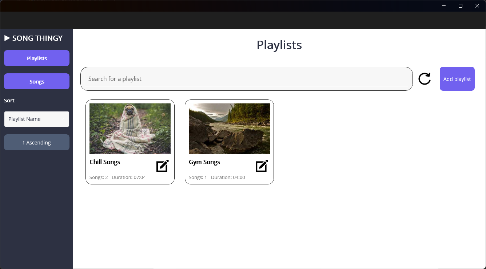

# Song & Playlist Manager

A cross-platform CRUD application for managing songs and playlists, developed using modern architectural principles and .NET MAUI.

> This project was developed as part of a university assignment.

## Authors
- Adam Běhoun
- Alexandra Pacalajová
- Zdeněk Teller
- Jozef Sládeček

## Overview

This application enables users to manage their personal music library by creating, editing, and organizing songs and playlists. Developed by a team of four, the project focuses on clean code structure, layered design, and maintabality.

## Features

- Full CRUD functionality for songs and playlists  
- Search, filtering and sorting capabilities  
- Cross-platform UI with .NET MAUI  
- MVVM pattern for separation of concerns  
- Layered architecture for scalability and maintainability  
- CI/CD pipeline with Azure DevOps  

## Tech Stack

- **Language:** C#  
- **UI Framework:** .NET MAUI  
- **Architecture:** MVVM + Layered  
- **Database:** SQLite
- **DevOps:** Azure DevOps (Repos + Pipelines)

## Screenshots

### Songs View

### Song Details

### Playlist View

### Playlist Details

### Add Songs to a Playlist
